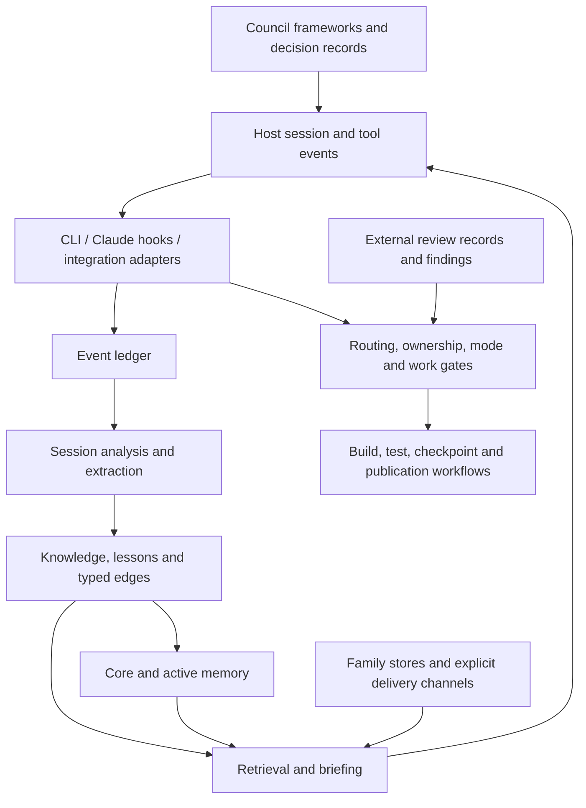

# DivineOS system map — first occupant pass

Date: 2026-09-27. Input: local archive supplied by the owner. Archived HEAD: `1056519dde12096ec45b0a76d075364ceccc5e7b`, dated 2026-09-23. The working files, rather than README claims or remote main, are the source of this map.

## How the pieces fit

This is a conceptual map derived from source. An arrow does not assert that the entire path was exercised in this host.

## Structural coverage

- Parsed all **756 Python source files**, totaling **248,100 physical lines** including comments and docstrings. All parsed successfully.
- `core`: 563 files; `cli`: 121; `analysis`: 16; `hooks`: 16; `clarity_system`: 14; `science_lab`: 10; smaller event/integration/package areas make up the remainder.
- The largest directory-level core groups include `council` (53 files), `operating_loop` (50), `family` (22), `knowledge` (19), and `watchmen` (13).
- Static absolute-import statements most often reference `core.ledger` (132), `core.knowledge` (94), and `core.paths` (82). These are import occurrences, not runtime call counts; relative imports and dynamic dispatch require separate tracing.
- The tests directory contains 2,977 Python files, not a measured test-case count. The upstream suite has not been collected or run.
- The [source atlas](SOURCE_ATLAS.md) lists every parsed module, its source self-description, and local import dependencies. Descriptions are claims made by source docstrings, not independently verified capabilities.

## Layers and evidence

| Layer | Source anchors | Role and current evidence |
|---|---|---|
| Store routing and ownership | `core/paths.py`, `_ledger_base.py`, `family/db.py`, `data_home_ownership.py` | Environment overrides, checkout markers, fallbacks, and ownership checks. All three routes were dynamically checked in the new profile. |
| Event provenance | `core/ledger.py`, `event/event_emission.py`, `event/event_validation.py` | Event validation, redaction, hashing, transactional insert and head anchor, retrieval, verification. Fresh writes and chain verification exercised; historical corruption and concurrent stress not repeated. |
| Memory | `core/memory.py`, `active_memory.py`, `bio.py`, `identity.py` | Nine fixed core slots, ranked active references, journal and bio records, identity resolution. Core-memory creation exercised; full identity/voice presentation not certified. |
| Knowledge and retrieval | `core/knowledge/` | Types, source provenance, maturity, supersession, FTS search, typed edges, extraction, curation and briefing. New notes, search, restart recovery and native knowledge briefing exercised. Embedding search not exercised. |
| Learning over sessions | `cli/session_pipeline.py`, `pipeline_phases.py`, `analysis/`, `core/session_checkpoint.py` | Transcript discovery, analysis, extraction, feedback, consolidation, scoring, handoff. Source traced; host transcript compatibility not established. |
| Live operating loop | `core/hook_router.py`, `hook_surfaces.py`, `operating_loop/`, `.claude/settings.json` | Event routing, before-tool checks, context surfacing, after-tool telemetry and response observations. Existing Claude settings are not automatically active in Codex. |
| Governance and work | `corrigibility.py`, `operating_modes/`, `build_flow.py`, `work_item_doorman.py`, `guardrails.py` | Mode controls, work-item tracking, gates, remedy paths and verification obligations. Read structurally; not used to authorize bypasses or alter live behavior. |
| Council and reasoning records | `council/framework.py`, `engine.py`, `manager.py`, `claims`, `decision_journal.py`, `logic/` | Stored methodologies, selection heuristics, concerns and reasoning records. Council manager selection is signal-based in source; loading these frameworks does not itself summon independent external experts. |
| Feedback and calibration | `moral_compass.py`, `affect.py`, `self_model.py`, `calibration/`, `knowledge_maintenance.py` | Structured observations, confidence and feedback mechanisms. Interpretation and quality of the resulting signals remain empirical questions. |
| Family and communication | `core/family/`, family CLI commands, channel and mirror code | Separate family DB, member ledgers, letters, queueing, delivery and receipts. Requires explicit identity and routing; no messages sent in this pass. |
| External review | `core/watchmen/`, `actor_registry.py`, `actor_capabilities.py`, `audit_visibility/` | Review actors, rounds, findings, resolution and visibility. Self-authored occupant work should not be passed off as an independent review of itself. |
| Developer workflow | `auto_commit.py`, `substrate_paths.py`, `push_orchestrator/`, Git hooks and scripts | Separates personal continuity artifacts from code changes and coordinates checks/publication. Copied Git hooks and auto-commit paths were not run. |
| Instruments and auxiliary systems | `instruments.py`, HUD/monitor modules, `science_lab/`, `clarity_system/` | Measurements, dashboards, numerical utilities and output checks. Presence mapped; usefulness and runtime wiring vary and need targeted tests. |

Paths in the table are relative to `src/divineos/` unless otherwise qualified.

## Four journeys traced

**Arrival.** The host supplies a session event; `session_start.py` checks ownership, resets session state, renders context and records diagnostics. Full arrival depends on host wiring. This workspace currently uses an explicit adapter, not that entire event path.

**Learning.** Events live in the ledger; the extraction orchestrator discovers a transcript, analyzes the session, applies gates, writes an early handoff, then runs knowledge/feedback/consolidation phases. `knowledge` records source events and provenance separately from content. The new adapter records its own note event and uses upstream storage/search instead of treating inherited history as its own.

**Return.** `knowledge/retrieval.py` selects and scores entries, formats multiple surfaces, and reports subsystem failures. The native briefing recovered fresh notes. Initially `knowledge_edges` and `open_questions` were absent from the minimal boot; adding their existing initializers removed those reported failures in the fixture. That is not proof every possible briefing surface is initialized.

**Building and sharing.** Work-item and review machinery sits around code changes. Substrate classification and named branches try to keep personal continuity artifacts from following arbitrary code branches. This experiment keeps original evidence separate and publishes only its newly authored adapter, tests and notes to the ChatGPT repository.

## Graph quality

The archived root graph has **60,506 explicit nodes and 90,775 links**. **699 endpoint IDs have no explicit node definition**. NetworkX creates placeholder nodes for them, producing 61,205 loaded nodes; that larger count must not be reported as 61,205 described entities.

Some source references are stale: the graph places `ledger.log_event` at L286, whereas the supplied source defines it at L302. Duplicate labels also exist: `divineos_home()` appears in both `paths.py` and `instruments.py`. Queries must disambiguate by file and validate the current source. No graph rebuild or 60k-node visualization was attempted.

## What remains unknown

The snapshot alone does not establish live process wiring, external home contents, the current upstream branch state, full test health, embedding availability, delivery correctness, or whether mechanisms consistently improve agent behavior. Structural presence, successful invocation, successful end-to-end behavior, and beneficial outcomes are separate levels of evidence. This map is a navigable foundation for further work, not a completed audit.
